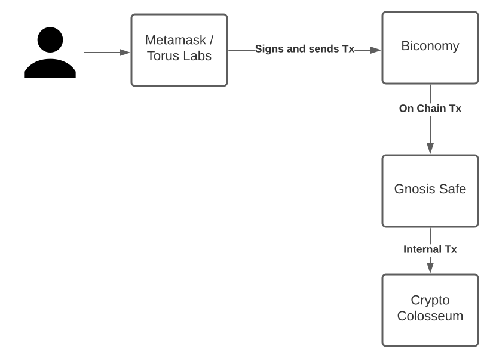
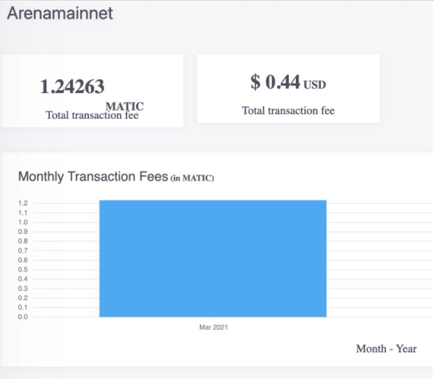

Crypto Colosseum is a layered game: easy to get started, difficult to master. Nothing blocks users signing up or playing. That includes everything from game design (just bet on a name you like) to the choice of blockchain.

That being said, we live by the blockchain ethos and never custody keys nor keep off chain data in proprietary databases. Crypto Colosseum runs entirely on decentralized technology.

Playing Crypto Colosseum is straightforward and works for both new non-crypto users and power users with Metamask. It’s imperative both sets of users find it easy to play the game. We ensure an intuitive experience so that players can focus on the gaming experience, rather than being bogged down by the complexities of blockchain. The battle is between digital gladiators, and not between you and your sanity. 

Here’s how we do it.

* Built on [Polygon](https://polygon.technology/) (a fast ethereum side chain with lots of adoption)
* Off chain data is held on [Sia Skynet](https://siasky.net/) (Decentralized storage)
* Sign up using existing socials or email (if you want) using [Torus Labs](https://toruswallet.io/).
* A [Gnosis safe](https://docs.gnosis.io/safe/) for every user is created at signup: players get started with a zero MATIC balance.
* Relay transactions using [Biconomy](https://biconomy.io/) to make the game intuitive & gasless

Here’s the signup flow:

* User uses Metamask or creates a wallet with Torus Labs
* Browser calls our serverless function and a Gnosis Safe is deployed under user control.
* 1000 $PTG deposited in their newly created safe.

During play the user’s transactions are relayed through Biconomy and their new gnosis safe. At any time they can change the ownership of that safe to a different wallet.  

Thanks to Biconomy, the users find it  incredibly easy to get started, bet on tournaments and buy items. Moreover, this approach also maintains player custody over all their assets.

Here’s a video of it in action:

    <iframe src="https://www.loom.com/embed/f925c5b9f2bf43ccb66866b887b17769" frameBorder={0} webkitallowfullscreen={'true'} mozallowfullscreen={'true'} allowFullScreen style={{position: 'absolute', top: 0, left: 0, width: '100%', height: '100%'}} />

Crypto Colosseum is high in the rankings of usage on the Polygon network (in at least the top 10). Yet, transaction costs are so low we can easily afford to cover the gas for all the transactions and offer a gasless experience! 

We find it really easy to sponsor these gas costs using Biconomy’s meta-transactions. Moreover, you can also easily track your gas sponsorship spendings on the dashboard. 

(That is for over 4000 player transactions).

We have a proto library to make deploying a gnosis safe and relaying through Biconomy really easy: https://github.com/quorumcontrol/kasumah (however, it’s new and undocumented).

In the end, Crypto Colosseum provides a web2 experience using web3 tech with a variety of off the shelf tools combined with targeted custom library components. It is efficient, effective and powerful like a good finishing move in the arena.

You should join our discord: https://discord.gg/Z2S3EtQKCn

Fancy a little whimsical violence? A little degenerate gambling? Join us in the Arena: https://arena.cryptocolosseum.com

About Biconomy 

Biconomy is a technology company building the multi-chain transaction infrastructure for next-generation Web 3 applications. Through Biconomy’s powerful and easy-to-use APIs, developers can enable a simple and customized user journey so that their end-users don’t get frustrated by blockchain complexities. By solving key pain points at the crypto transactional layer, Biconomy is on a mission to simplify Web 3 experiences that will drive mass adoption.

[Telegram](https://t.me/biconomy) | [Blog](https://medium.com/biconomy) | [Twitter](https://twitter.com/biconomy) 

