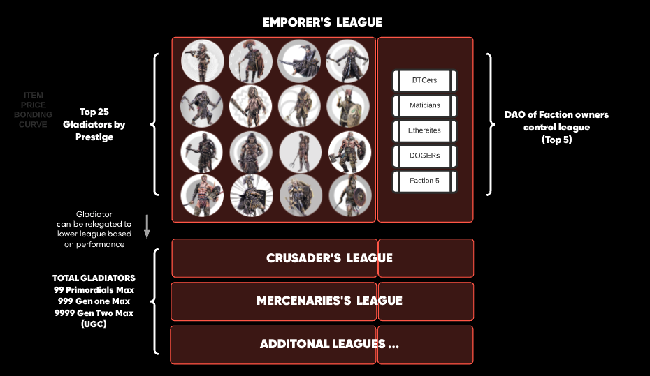

The Emperor's League is the pinnacle of the Crypto Colosseum world.
The biggest prize purses, the most powerful gladiators, the highest stakes.

The plan is for there to be a 25 gladiator cap on this league in the future.

To reach that the Emperor's League will grow to 35 and then a new league will 
be formed _below_ it.  The working name for this lower league is the "Crusader's League".
The lowest ten gladiators will be relegated to the Crusader's League and daily tournaments
will be held for them.  This is likely to be 1/day to start.
Once that happens the 25 gladiator cap on the Emperor's League will be set and permenant.

Each 4 weeks there will be a relegation week.  The top 3 gladiators from the Crusader's 
League will be moved up into the Emperor's League and the bottom 3 in the Emperor's League
will be "relegated" to the Crusader's league.  

All new gladiators will then join the Crusader's League as the number of gladiators
in the Crypto Colosseum continues to grow.  A similar pattern will occur when that grows 
to 35.

