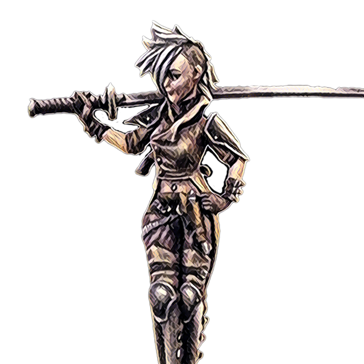

The arena features 99 primordial gladiators. Only 25 are currently minted and building history. Each of these gladiators features rich backstories. They have a record in the Arena and have accumulated trophies and $PTG through battles. Collectable gladiators cannot be minted, they are forged by emerging victorious in the Arena.

Let's take a look at Katana. As of 16 March, 2021 she is the Arena's winningest gladiator: https://arena.cryptocolosseum.com/gladiator/3?faction=MTC (some history happened on testnet and is not displayed at that link). Notice her token id: 3.

### tldr;

Each gladiator Contracts has a:
* Rich backstory
* Provable Provenance
* An unmintable history of glory in the Arena
* Cashflow

By owning a gladiator contract you are becoming part of the Arena, shaping the future of the battle and earning PTG while you sleep and your gladiator battles on your behalf.

### Katana

<blockquote>
Ariana Katana was orphaned at a very young age.
Her entire family was cut down in the street by a squad of imperial guards trying to escape the Capital.

Katana was adopted into a traveling circus outside the imperial city. The ringmaster knew her and rescued her from the streets. Over time she realized many of the acts in the circus involved a lot of violence but there was also a lot of laughter. She adapted to conflict.

In the circus, she took on the persona of a pirate and excelled at combat. Eventually, she parlayed the skills of acrobatics, knife throwing, sword swallowing and even showmanship into a very promising career in the Arena.

The rest as they say, is future history.
</blockquote>

Katana's backstory is lovingly crafted by [GPT3](https://en.wikipedia.org/wiki/GPT-3). You can relive one of her epic tournament wins [here](https://arena.cryptocolosseum.com/battle/0x010001000004/1/0).

As she continues to battle in the Arena, she is accumulating PTG ([20% of the bets](../economy)).

Owning the Katana NFT (referred to as the 'gladiator contract') is both a timeless collectable piece of art, history, battles, glory, and also a *cashflow* generating asset.

