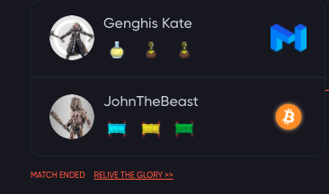

Let's look at March 22nds Omega tournament and the first battle.  https://arena.cryptocolosseum.com/tournament/1099528405024

Genghis Kate https://arena.cryptocolosseum.com/gladiator/9?faction=MTC vs 
John The Beast: https://arena.cryptocolosseum.com/gladiator/4?faction=BTC

The battle mechanics are fairly simple. Attack determines the maximum "attack" roll and defense determines maximum "defense roll". Each battle is turn based. At the beginning of the turn we roll a 3-sided dice to determine who is the attacker. 

If you won your last roll you get the 3rd side... otherwise it's a coin-flip. So if you won (attacking or defending) last you have a 2/3 chance of being the attacker.  This enables gladiators to get on a roll and stage big comebacks.  Sometimes we refer to this as who has initiative.

Then each side rolls a dice up to their maximum score (attack/defense). If defense is higher then it is a block.

If the attack is higher then the hit points removed are attackRoll - defenseRoll.
This determination of who is attacking and what is the result of that attack are repeated until one gladiator's health goes to zero or below.

The next factor to consider is items. In our example above Genghis Kate has an Oil of Grinding attack so her attack roll is +100 on every attack roll she makes.

Some items have a chance of getting used and a maximum number of uses... like her Elixir of Recovered health which will only work two times and has a percentage chance of getting used each round.

JohnTheBeast has a "Curse of the Crypto King" which, from the description, is a "Curse which reduces defense by three hundred up to two times."

So that means up to 2x per battle he will have a chance of having his defense roll reduced by 300.  You can check out the odds of items activating in the table [here](/gamemechanics/items).

The last major component in combat is what faction a gladiator is fighting for.  We will cover that in the next installment.
