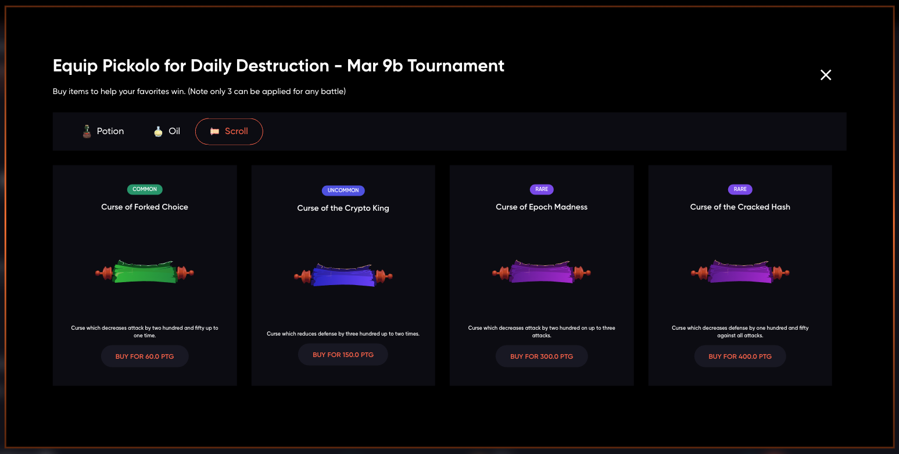

There are four different types of items available in Crypto Colosseum.
The four categories (currently) are potions, scrolls, oils and dusts. There are three levels of rarity for each type in the current set of items.

More items will be created as the game continues to evolve.

Some items help gladiators by increasing their stats or health. Other items, often referred to as _curses_, decrease their stats or health.

Each new item is released on a bonding curve and the price fluctuates based on market demand. This means an astute player can invest and then resell powerful items as they are released.
[See the economy section on items](/economy/items)

:::tip
Note that any items applied are reset for each round within the tournament. So a potion drunk during the first round is available again for the finals.
:::

Items have variable numbers of usages and differing chances of triggering. This can have a big impact on their value and their impact on the game.

Overview of First Generation of Items

** Potions: **

| Name  	| Effect   	| Trigger%  	|
|---	|---	|---	|
| Potion of Healing  	| Adds two hundred health one time  	| 25%  	|
| Potion of Token Might  	| Adds two hundred and fifty health up to two times  	| 25%  	|
| Elixir of Recovered Consensus  	| Adds three hundred and fourty health up to two times  	| 35%  	|
| Elixir of the Forever Ledger  	| Adds one hundred and eighty health up to four times  	| 30%  	|

** Oils: **

| Name  	| Effect   	| Trigger%  	|
|---	|---	|---	|
| Oil of Sharpness  	| Oil which enhances weapons to add one hundred and sixty attack up to two times  	| 70%  	|
| Oil of the Swift Doge  	| Oil which enhances armor improving defense by two hundred up to three times  	| 50%  	|
| Oil of Grinding Attack  	| Oil which enhances weapons to add one hundred attack to every attack  	|   	|
| Oil of the Elusive Moon Shot  	| Oil which enhances armor improving defense by two hundred and fifty up to three times  	| 70%  	|

** Curses: **

| Name  	| Effect   	| Trigger%  	|
|---	|---	|---	|
| Curse of Forked Choice  	| Curse which reduces attack by two hundred and fifty up to one time  	| 25%  	|
| Curse of the Crypto King  	| Cursed scroll which reduces defense by three hundred up to one two times  	| 30%  	|
| Curse of Epoch Madness  	| Curse which reduces attack by two hundred against up to three times  	| 30% 	|
| Curse of the Cracked Hash  	| Curse which decreases defense by one hundred and fifty against all attacks  	|   	|
