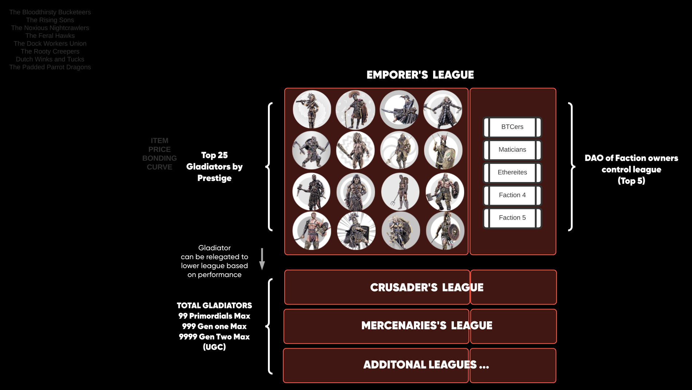

:::tip

This documentation is a work in progress.

:::

Here’s a walk through of PTG and how you can earn your way to emperor of the Arena.

* Gladiators battle in regular tournaments.
* Gladiators belong to factions (ETH, BTC, MATIC, DOGE)
* The price movement of their faction affects the outcome of their matchup.
* Players bet on which gladiator will win.
* Players buy items which enhance (or hinder) a gladiator’s chance to win.
    * For example, an item might increase attack or decrease defense.
* Players that bet on the winning gladiator share in their pro-rata share of the entire pot (minus gladiator winnings).
* Gladiators win 5% of the betting pool (not including incentives).
* 25% of the gladiator’s winnings go to the Faction they fought in.
    * For example, if a gladiator fought in a tournament with $PTG 100 at stake and won, the gladiator would receive $PTG 3.75 and the faction $PTG 1.25

Already we have an emergent multiplayer game with interesting psychological dynamics. Do I wait to bet big? Do I load up my gladiators with the maximum allowed items and then wait? Do I bet big and *then* come in and fill up items on other gladiators. Each tournament is like a giant game of bridge but instead of cards we have gory battles and AI-enhanced pre-battle taunting.

Everything in the game is a token. PTG is a token, the gladiators are NFTs, the items are NFTs, and even the Factions themselves are tokens which can be owned. Owners of factions may transfer PTG out of factions should they desire and owners of gladiator NFTs may also transfer out the gladiator’s PTG.

Betting lets players stack PTG and they only need a little luck (and a good ITEM strategy). Bonuses added to the prize pools will be larger earlier on and be reduced over time.  This gives the advantage to those that get in early.

Owning gladiator contracts or factions (or parts thereof) earns you passive PTG.  This is primarily done through staking PTG into a faction.  The earned PTG can then be used for buying bigger shares of existing factions, retaining the services of your own gladiator or even starting a new gladiator or faction and working them up through the laddering system.

The Arena is divided into leagues. At the time of this writing there are two operating leagues: the Emperor’s league and the Praetorian league. The Emperor's league is the top-echelon league with only the highest rated gladiators competing. At any time only the top 25 gladiators and top 5 factions in terms of PTG holdings may participate in this league. The Praetorian league features newer gladiators who have proven their worth, but are still working their way up toward the best of the best.

Leagues are implemented as a [DAO](https://www.investopedia.com/tech/what-dao/), with the factions as the voting members. Factions may mint new items which are only available for use within their league. These items are immediately placed into bonding curves (on Quickswap) vs PTG.  The funds generated by selling items are fed back into the prize purses, particularly for premium tournaments.

It is clearly advantageous to acquire gladiators and factions and to participate in the highest league possible, as this earns you larger and larger PTG rewards in a passive manner. This is a great incentive to lock up as much PTG as you can, in order to keep increasing the size of your bags.

Given the influence of chance and items on the outcome of battles and the fact that 75% of the purse is distributed to bettors, there is a strong chance that new players will be able to stack enough PTG to compete in the upper echelons. 
