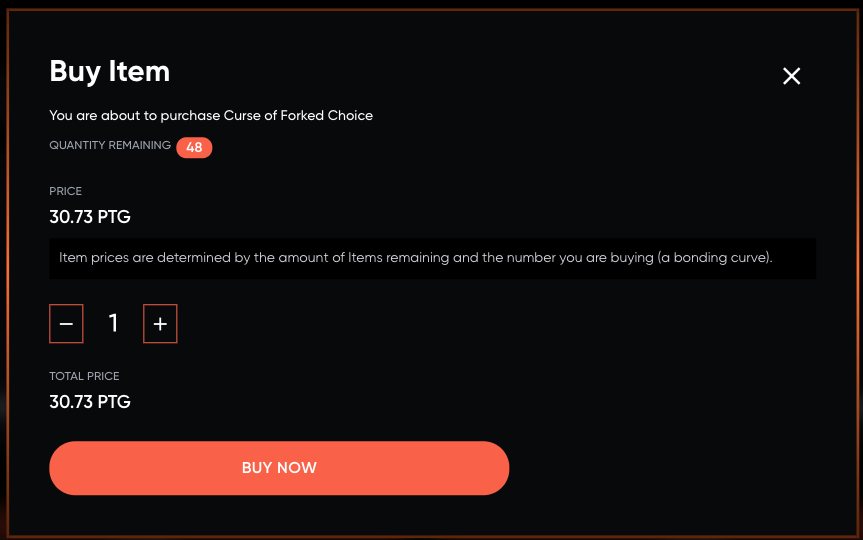
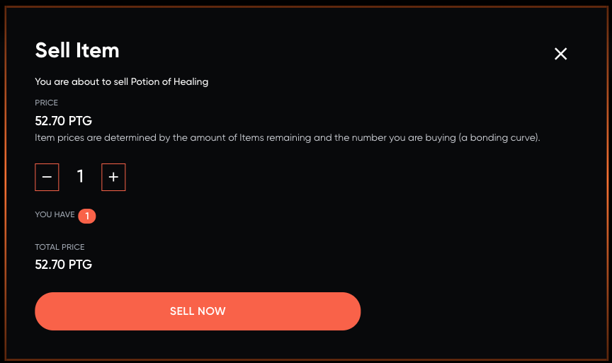

:::tip

Work in progress!

:::

[UniswapV2](https://www.reddit.com/r/UniSwap/comments/lcwk5t/explain_it_to_me_like_im_5/gm3u2k9/?utm_source=share&utm_medium=web2x&context=3) contrats are deployed to Polygon and items are released to bonding curves on those contracts.

Every week after the weekly tournament (currently wednesdays 20:00 CET) items are added to the bonding curve. This will make the price go down. As players buy items the price will go up. Please see the link above for an explanation of how Uniswap (bonding curves) work.

Players can freely trade items through the marketplace, both buying and selling. The rarity of the item determines how many additional items will be released per week.

## Collectibles

Not all items are released weekly. These are special community items. These are still owned by the players and may be traded, but they are not placed on bonding curves.

