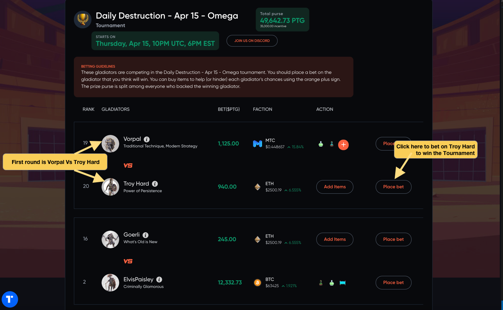

Crypto Colosseum is (in the beginning) a simple gambling game.

Gladiators fight in tournaments.  You place your bet on which of the four gladiators will win the tournament.  You get a share of the prize purse if you are right.

To get started, the first thing you need to do is sign up.  Click on the orange "Sign in / Sign up" in the upper right hand corner to do so. Its easy, we promise.

There are two different ways to login, but if you are new to the game and to crypto, the easiest way is to use an existing account (like gmail).  When you do this we are actually creating a special vault or wallet to receive and spend your cryptocurrency(PTG).  It will also hold your in-game NFTs in the future.  You own the wallet and its contents and we cannot access it without your permission.

[Torus](https://tor.us) is used to create your wallet and link it to one of your existing accounts.  You don't need to worry about it for now, but you can access your Torus wallet through the "T" in a blue circle in the bottom left at any time.

After completing the process you will recieve a grant of 6 free 100 PTG bets. This is the ingame currency of Crypto Colosseum.  You can exchange it for other cryptocurrencies or buy more PTG but that will be covered in a later guide.

The signup is super easy and will take no more than a minute.

Now you have logged in, have free bets and are ready to place your first bet.  You should see the lobby screen which shows upcoming tournaments,recent battles and a player leaderboard. If you are not in the lobby just click the Crypto Colosseum logo in the upper left to return there at any time.   We want to bet on the *next upcoming tournament* so big orange button that says "Go to Tournament" next to the countdown is the one we want.

We constantly post links to upcoming tournaments in [our discord](https://discord.gg/Z2S3EtQKCn) so you should join us there to hear about upcoming tournaments, contests and special events.

Now the last step is to place a bet on the tournament page.  There is a variety of information on the tournament page but all you need to worry about is which gladiator(s) you want to bet on.  Pick one and find the associated orange "Bet Now" button and click it. 

If you want to know what the other info on that page means checkout [tournament basics](https://docs.cryptocolosseum.com/tournaments).  It is really not needed to make your first bet though!

If you want to know more about how winners are decided before you bet, check out [combat basics](https://docs.cryptocolosseum.com/gamemechanics/combatexample) to learn more.

Once you click to place your bet a popup will ask you about your wager and give you the option to use one of your free bets.  

Once you click on "USE FREE 100 PTG BET", your wallet will check if you are really sure you want to place the bet.  Confirm the transaction and you are off and running!  (Look for popup blockers etc if you dont see the confirmation requests).

The game is surprisingly deep considering how simple the basic mechnicisms are.  Before worrying about other aspects of the game, bet a few times and get a feel for the game.  Then when you are ready you can begin to explore the item market (on bonding curves), bid on a gladiator contract (income generating NFT) and get your own share of the crypto factions and share in their profits.

Don't forget to join us in [our discord](https://discord.gg/Z2S3EtQKCn) where the gladaitors talk trash (courtesy of our AI) and fans cheer on their favorites.

Most of all, have fun!  

It's whimsical violence.  It's degenerate gambling and The Arena just gave you free money.  

Battle time!
