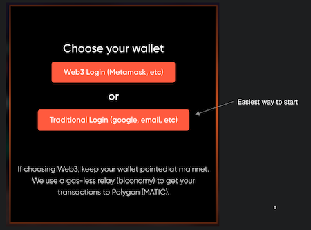
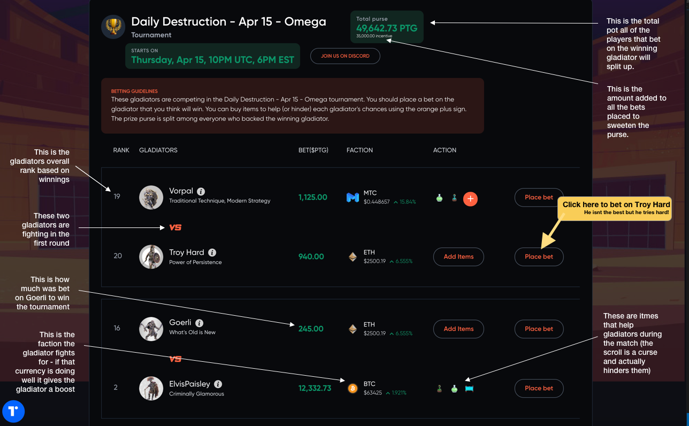

Crypto Colosseum is (in the beginning) a simple gambling game.

Gladiators have tournaments.  You place your bet on which of the four gladiators will win the tournament.  You get a share of the prize purse if you are right.

To get started the first thing you need to do is sign up.  Click on the orange "Sign in / Sign up" in the upper right hand corner to do so. Its easy we promise.

There are several different ways to login, but if you are new to the game and to crypto, the easiest way is to use an existing account (like gmail).  When you do this we are actually creating a special vault or wallet to receive and spend your crypto currency (PTG).  (As well as hold your in-game NFTs)  You own it and we can not access it without your permission.

The creation of your wallet and the linking to your existing account elsewhere is done through Torus.  You don't need to worry about that for now but you can access that through the "T" in the bottom left at all times.

After completing the process and confirming you want to give the game a try you will recieve a grant of 1000 PTG or prestige.  This is crypto currency minted just for playing Crypto Colosseum.  You can exchange it for other crypto currencies or buy more but thats a later guide.

That may seem like a lot but its super easy and will take no more than a minute.

Now you have PTG and you are ready to place your first bet.  You should see the lobby screen which shows upcoming tournaments in the top row and tournaments that recently completed along the bottom. If you are not in the "lobby" just click the Crypto Colosseum logo in the upper left to return there at any time.   We want to bet on the *next upcoming tournament* so the first one on the left in the first row is our target.

We constantly post links to upcoming tournaments in [our discord](https://discord.gg/Z2S3EtQKCn) so you should join us there to hear about upcoming tournaments, contests and special events. 

Now the last step is to place a bet on the tournament page.  There is a lot on the tournament page but all you need to worry about is which gladiator you want to bet on.  Pick one and find the associated orange "Bet Now" button and click it.  Below you can see what some of the other info is but for your first bet, bet small (maybe 100 PTG) and pick whichever appeals to you the most.

If you are the type to want to know more before you bet check out [combat basiscs](https://docs.cryptocolosseum.com/gamemechanics/combatexample) to learn more.

Once you click to place your bet a popup with ask you how much to bet.  Then once you submit that your wallet will check if you are really sure you want to put some of the PTG in your pocket on the line.  Confirm that and you are off and running!  (Look for popup blockers etc if you dont see the confirmation requests).

The game holds surprising complexity and there are many aspects to learn but bet a few times and then explore the item market (on bonding curves), bidding on a gladiator contract (all income generating NFTs) and even explore getting your own share of the factions and their winnings.

Most of all have fun!  
Its whimsical violence.  Its degengerate gambling and we just gave you free money.  
Party time!
