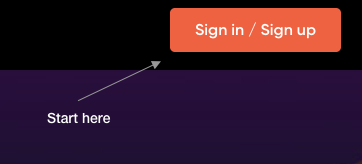

Crypto Colosseum is (in the beginning) a simple gambling game.

Gladiators fight in tournaments.  You place your bet on which of the four gladiators will win the tournament.  You get a share of the prize purse if you are right.

To get started, the first thing you need to do is sign up.  Click on the orange "Sign in / Sign up" in the upper right hand corner to do so. Its easy, we promise.

There are several different ways to login, but if you are new to the game and to crypto, the easiest way is to use an existing account (like gmail).  When you do this we are actually creating a special vault or wallet to receive and spend your cryptocurrency(PTG).  It will also hold your in-game NFTs in the future.  You own the wallet and its contents and we cannot access it without your permission.

[Torus](https://tor.us) is used to create your wallet and link it to one of your existing accounts.  You don't need to worry about it for now, but you can access your Torus wallet through the "T" in a blue circle in the bottom left at any time.

After completing the process you will recieve a grant of 1000 PTG or prestige.  This is cryptocurrency minted just for playing Crypto Colosseum.  You can exchange it for other cryptocurrencies or buy more PTG but that will be covered in a later guide.

The signup may seem like quite a few steps but it is super easy and will take no more than a minute.

Now you have PTG and you are ready to place your first bet.  You should see the lobby screen which shows upcoming tournaments in the top row and recently completed tournaments along the bottom. If you are not in the "lobby" just click the Crypto Colosseum logo in the upper left to return there at any time.   We want to bet on the *next upcoming tournament* so the leftmost one in the first row is our target.

We constantly post links to upcoming tournaments in [our discord](https://discord.gg/Z2S3EtQKCn) so you should join us there to hear about upcoming tournaments, contests and special events.

Now the last step is to place a bet on the tournament page.  There is a lot on the tournament page but all you need to worry about is which gladiator(s) you want to bet on.  Pick one and find the associated orange "Bet Now" button and click it.  Below you can see some additional information but for your first bet, bet small (maybe 100 PTG) and pick whichever gladiator appeals to you the most.

If you want to know more before you bet check out [combat basics](https://docs.cryptocolosseum.com/gamemechanics/combatexample) to learn more.

Once you click to place your bet a popup will ask you how much you wish to wager.  Then once you submit that your wallet will check if you are really sure you want to put some of the PTG in your pocket on the line.  Confirm that and you are off and running!  (Look for popup blockers etc if you dont see the confirmation requests).

The game is surprisingly complex and there are many aspects to learn, but bet a few times and then you can begin to explore the item market (on bonding curves), bidding on a gladiator contracts (income generating NFTs) and getting your own share of the factions and their winnings.

Most of all, have fun!  
It's whimsical violence.  It's degenerate gambling and The Arena just gave you free money.  
Battle time!
