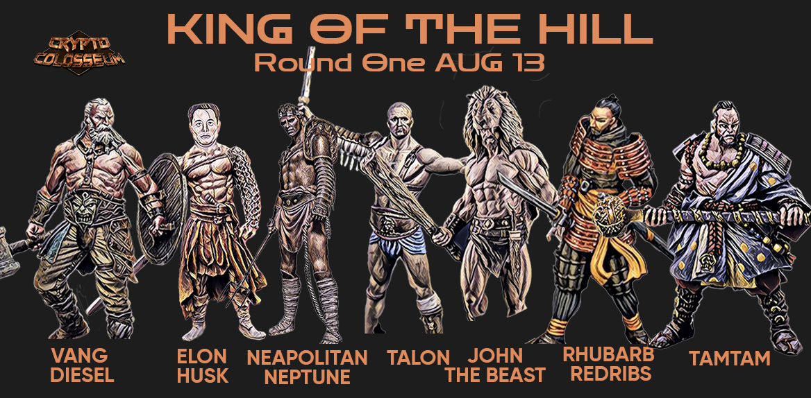

A pool of (usually 6 to 8) gladiators is selected to participate in the King of the Hill Tournament.

Two gladiators from the pool are randomly chosen to fight.  (2500 PTG is put in the prize purse and there is betting.)
Whoever wins the match rejoins the pool and the loser is eliminated from the tournament.

Afterward, two new gladiators are randomly paired.  (For now, rolled in discord.)
A new one-on-one match of those two is created with a 2500 PTG prize purse, and after a short amount of bidding that match is run.

This is repeated until only one gladiator remains.

That gladiator is declared the King of the Hill, and that gladiator's contract owner recieves a 10000 PTG prize.

Our first ever King of the Hill Tournament was the Top 7 Free Agent Gladiators by rank on August 13th, 2021.

