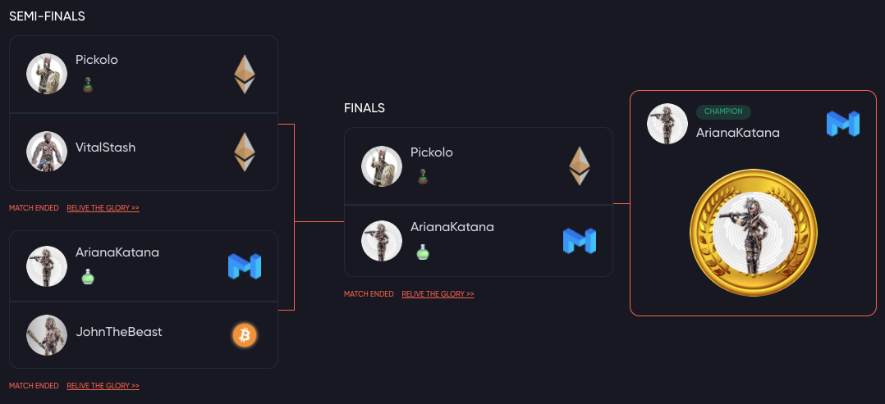

### Crypto Colosseum is a game of degenerate gambling and   whimsical violence.

### [You should join our discord](https://discord.gg/Z2S3EtQKCn).

Crypto Colosseum is a new style of blockchain game on the Polygon (formerly Matic) network. It’s multiplayer, it’s casual, it’s crypto-economic, it’s enhanced by AI and (most importantly) it’s fun.

Twice daily, gladiators battle it out in the arena. They fight for factions (ETH, Polygon, BTC). The price movement of those factions influences the matchups.

Players (that's you) bet on the match. Players buy items to boost warriors (or undermine foes).

### Many ways to stack your [PTG](./economy/prestige_token)

* Wager correctly on your favorite warrior.
    * Remember - you can influence these battles by purchasing [items](/economy/items)
* Collect and trade [items](/economy/items).
* Purchase gladiator contracts for passive income.
* Purchases shares in factions for passive income.
* Farm your PTG for passive income.

#### Example tournament

