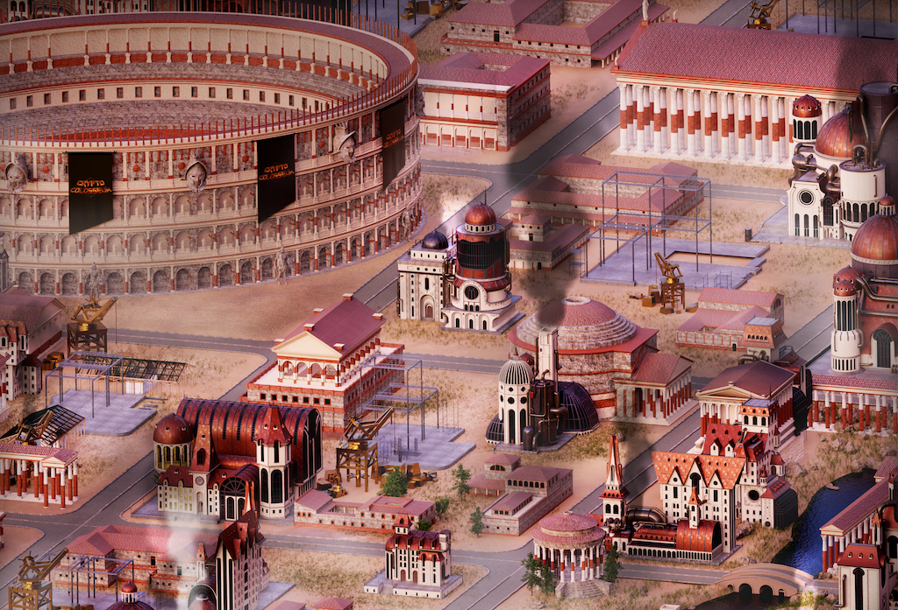
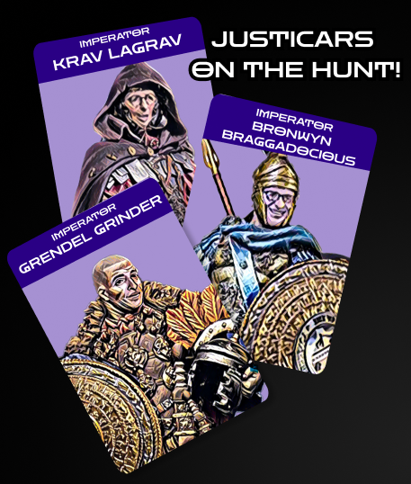
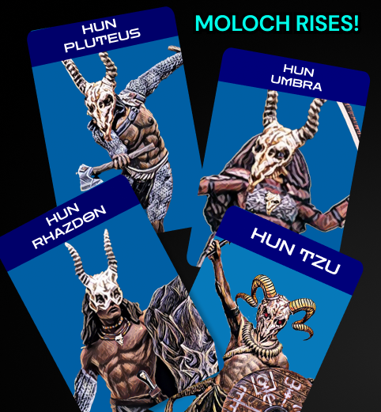

 
Welcome to the Crypto Colosseum.
 
We have assembled the greatest warriors from across the
Crypto-Roman Imperium and set them in bloody competition at
grand tournaments for the entertainment of all crypto-citizens.
 
With the help of our bioconsensarii we patch them up
and send them into battle after battle climbing the rankings
and bringing glory to their patrons and their ludi.
 
The Crypto Colosseum itself is a marvel of retro-modern
steam-powered crypto engineering.  The polygods of the Imperium
ensure that all battles are fair and that the rule of
no-rules bloody violence is strictly enforced until there is only
one champion standing.
 
The Champions of the Crypto Colosseum play out a deadly game
that is a proxy for the more significant battles simmering below the surface.  The Emperor uses the Colosseum fights to distract
the populace and provide an outlet for the competition simmering
between the many competing groups and the heroes that lead them.  Many believe these manipulations stave off the pure apocalyptic anarchy that would follow the empire's collapse.  Though, of course, there are just as many that believe a better world would emerge from the embers of the old.
 

 
The heroes of the arena are seen as paragons of the many forces
fighting for the future of the Crypto-Roman Empire.
Beyond the crypto-market factions (BTCers, Ethereites, Dogers, and Maticians), there are agents arrayed to both defend or bring down
the empire.
 
The powerful Justicars stand at the Emperor’s back using their
powerful cryptomancy to crush the enemies of the empire.
Both in and outside the arena, they bring a sense of implacable
dread to their enemies as they grind them to dust.
 

 
The Crusaders of the Decentralized Light rally the populace
to throw off their shackles and take ownership of their future.
The gospel condemns the central authority of the Emperor as a pox
upon the land and the potential for crypto transcendence.
 
The Children of Moloch, also known as the Huns, represent the latest
forces of pure chaos roving the very far East
in search of blood to slake their thirst.
 

 
Whether they come from the Arctic Jungles of the far West like Vang Diesel, the North like the fabrikators Goerli or Sander of the Claw, or from beyond the empire entirely, there are gladiators just out for
themselves and their own glory.  The brilliant circus performer Ariana Katana or the colorful Elvis Paisley sit atop the rankings of the
Crypto Colosseum elite taking on all who challenge them.
They avail themselves of the many pleasures the crypto-steam-powered
Imperial capital present as they bask in the glory and acclaim
of the throngs of passionate fans.
 
The Ludi (gladiator schools) are a focal point of power in the world of
crypto-Rome.  Gladiator patrons band together to help their champions increase in strength, pursue secret agendas, or simply follow their thirst for glory, 
prestige, and crypto riches beyond the dreaming of the lowly plebs.
 
The Crypto Colosseum exists in a world of whimsy, violence, gambling, and idealism.  It is both a cautionary tale and a damn good time!
